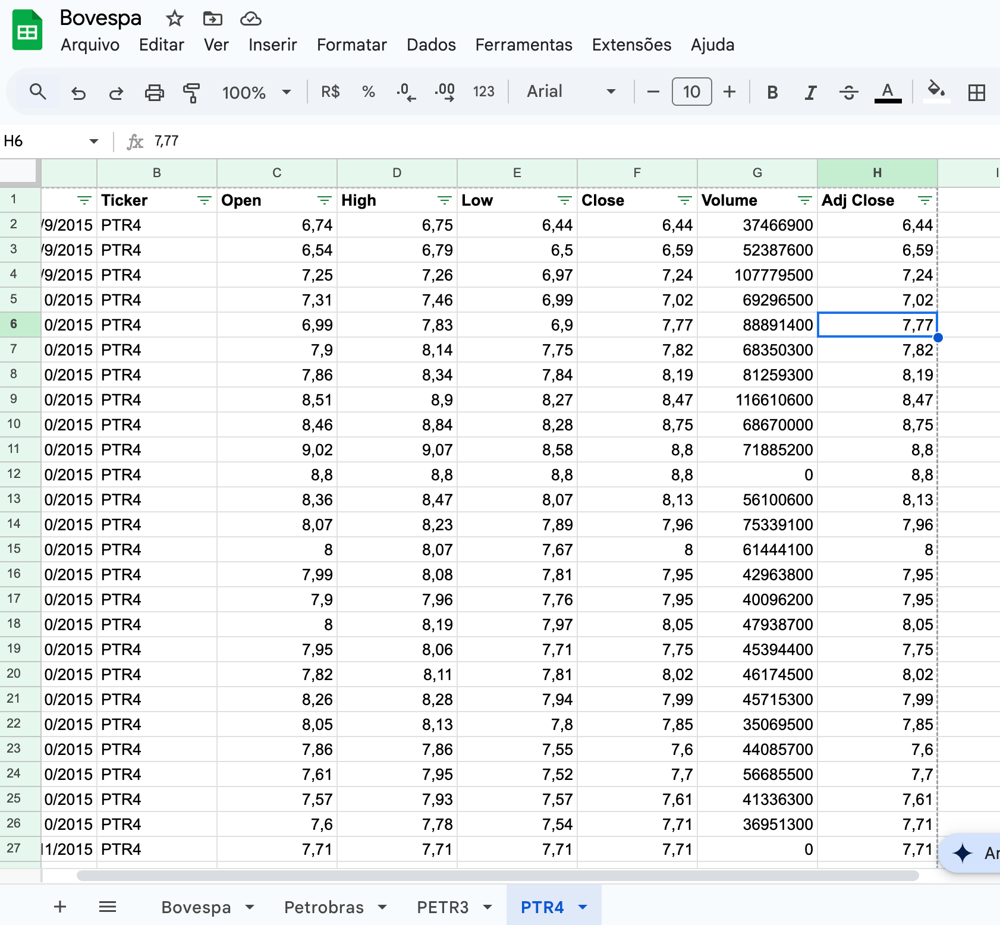

# Trabalho sobre Machine Learning

Enunciado do Trabalho

Referencia dados;

O conjunto de dados "Bovespa.csv" contém informações históricas de ações da B3, incluindo as ações da Petrobras (PETR3 e PETR4). Ele abrange o período de 28 de setembro de 2015 a 28 de setembro de 2016 e está disponível para download no Figshare.

Estrutura do arquivo CSV:

Data: Data da negociação.
Ticker: Símbolo da ação (ex: PETR3, PETR4).
Open: Preço de abertura.
High: Preço mais alto do dia.
Low: Preço mais baixo do dia.
Close: Preço de fechamento.
Volume: Quantidade de ações negociadas.
Este conjunto de dados possui aproximadamente 14.977 registros, abrangendo diversas ações listadas na B3, incluindo as da Petrobras.

Para adaptar este conjunto de dados para uma análise de machine learning, você pode seguir os seguintes passos:

Filtragem dos Dados da Petrobras: Utilize as colunas "Ticker" para selecionar apenas os registros correspondentes às ações da Petrobras (PETR3 e PETR4).
Seleção de Variáveis: 

Escolha as variáveis relevantes para a análise, como "Open", "High", "Low", "Close" e "Volume".

Criação de Variáveis Derivadas: 

Calcule indicadores técnicos, como médias móveis, volatilidade, ou outros indicadores financeiros que possam ser úteis para a análise preditiva.

Divisão dos Dados: **(30% para testes e 70% treino)**

Separe os dados em conjuntos de treino e teste, garantindo que o conjunto de teste seja representativo e não tenha sido utilizado no treinamento do modelo.

Treinamento e Avaliação do Modelo: 

Utilize técnicas de machine learning, como regressão linear, árvores de decisão, para treinar modelos preditivos.


## O que foi feito

Sepração de cada ação em uma base



Para os dias em que o volume foi zero, Será desconsiderado no treinamento do modelo


**Importações**

```python
import pandas as pd
import numpy as np
import matplotlib.pyplot as plt
from sklearn.model_selection import train_test_split
from sklearn.linear_model import LinearRegression
from sklearn.metrics import mean_squared_error
```

**Instalação**

```python
pip install pandas numpy matplotlib scikit-learn

```

**Carregamento dos dados**

```python
df = pd.read_csv("Bovespa - PETR3-LIMPA.csv")

```

**Limpeza e conversão dos dados**

```python
cols_to_convert = ["Open", "High", "Low", "Close"]
df[cols_to_convert] = df[cols_to_convert].replace(",", ".", regex=True).astype(float)
df["Volume"] = df["Volume"].astype(int)
df["Date"] = pd.to_datetime(df["Date"], dayfirst=True)
df = df.sort_values("Date").reset_index(drop=True)
```

**Variáveis de apoio**

```python
df["MA_5"] = df["Close"].rolling(window=5).mean()
df["MA_20"] = df["Close"].rolling(window=20).mean()
df["Volatility_5"] = df["Close"].rolling(window=5).std()
df["Daily_Return"] = df["Close"].pct_change()
```

MA_5 → Média móvel 5 dias

MA_20 → Média móvel 20 dias

Volatility_5 → Volatividade 5 dias

Daily_Return → Retorno diário

**Limpeza de valores vazios**

```python
df = df.dropna().reset_index(drop=True)

```

**Definição de valores preditores**

```python
features = ["Open", "High", "Low", "Volume", "MA_5", "MA_20", "Volatility_5", "Daily_Return"]
target = "Close"
X = df[features]
y = df[target]
```

**Divisão de treino  e teste** 

```python
X_train, X_test, y_train, y_test = train_test_split(X, y, test_size=0.3, shuffle=False)

```

**Treinar modelo → Escolha: Regressão Linear**

```python
lr_model = LinearRegression()
lr_model.fit(X_train, y_train)
```

**Teste do preditor → Conjunto de teste**

```python
y_pred = lr_model.predict(X_test)

```

**Avalição do modelo**

```python
rmse = np.sqrt(mean_squared_error(y_test, y_pred))
print(f"RMSE da Regressão Linear para previsão do Close: {rmse:.4f}")
```

**Gráfico**

```python
plt.figure(figsize=(14, 6))
plt.plot(df["Date"].iloc[y_test.index], y_test, label="Valor Real (Close)", color="blue")
plt.plot(df["Date"].iloc[y_test.index], y_pred, label="Previsão (Regressão Linear)", color="orange")
plt.title("Previsão do Preço de Fechamento (Close) - PETR3")
plt.xlabel("Data")
plt.ylabel("Preço (R$)")
plt.legend()
plt.grid(True)
plt.tight_layout()
plt.show()
```

**Todo código**

```python
import pandas as pd
import numpy as np
import matplotlib.pyplot as plt
from sklearn.model_selection import train_test_split
from sklearn.linear_model import LinearRegression
from sklearn.metrics import mean_squared_error

df = pd.read_csv("Bovespa - PETR3-LIMPA.csv")

cols_to_convert = ["Open", "High", "Low", "Close"]
df[cols_to_convert] = df[cols_to_convert].replace(",", ".", regex=True).astype(float)
df["Volume"] = df["Volume"].astype(int)
df["Date"] = pd.to_datetime(df["Date"], dayfirst=True)
df = df.sort_values("Date").reset_index(drop=True)

df["MA_5"] = df["Close"].rolling(window=5).mean()
df["MA_20"] = df["Close"].rolling(window=20).mean()
df["Volatility_5"] = df["Close"].rolling(window=5).std()
df["Daily_Return"] = df["Close"].pct_change()

df = df.dropna().reset_index(drop=True)

features = ["Open", "High", "Low", "Volume", "MA_5", "MA_20", "Volatility_5", "Daily_Return"]
target = "Close"
X = df[features]
y = df[target]

X_train, X_test, y_train, y_test = train_test_split(X, y, test_size=0.3, shuffle=False)

lr_model = LinearRegression()
lr_model.fit(X_train, y_train)

y_pred = lr_model.predict(X_test)

rmse = np.sqrt(mean_squared_error(y_test, y_pred))
print("RMSE da Regressão Linear para previsão do Close:}", rmse)

plt.figure(figsize=(14, 6))
plt.plot(df["Date"].iloc[y_test.index], y_test, label="Valor Real (Close)", color="blue")
plt.plot(df["Date"].iloc[y_test.index], y_pred, label="Previsão (Regressão Linear)", color="orange")
plt.title("Previsão do Preço de Fechamento (Close) - PETR3")
plt.xlabel("Data")
plt.ylabel("Preço (R$)")
plt.legend()
plt.grid(True)
plt.tight_layout()
plt.show()

```

**Previsão de PETR3**


**Previsão de PETR4**


